# 数字地形测量学

## 预习与概览

> 7.6 Wed 预习，了解这是什么样的一门课。

本书12章：

* 1～8章
  * 大比例尺测图基本理论与技术方法
    * 测量基本知识
    * 基本测量的原理和仪器
    * 测量误差基本知识
    * 控制测量
    * 地形图测绘技术基础
    * 大比例尺地形图测绘方法
* 9～12章
  * 9～10——数字测图
    * 数字地形图绘图的基本原理和技术基础
    * 大比例尺数字地形图测绘方法
  * 11——地形图在生产实际中的应用
  * 12——常用的专题地图测绘技术方法

这本书是**编著**，不是**著**，可惜。看来我需要多读一些文献补充，防止被烂教材坑。

> 真的无语，网上搜索数字地形测量学，都没有什么经验分享。这些前辈真是没有开源意识啊，多和研究计算机的同志们学学吧，不论想学什么计算机技术，网上都有一堆资料+经验分享。不希望地理学这个圈子再这么没有生机了。
>
> 我一定要把我的笔记开源。

再根据目录梳理一遍知识体系，顺便对这些名词提出疑问：

```mermaid
graph LR
A1(绪论)-->B1[测绘工作的任务及其在国民经济建设中的作用]
A1(绪论)-->B2[测绘科学的发展状况]
A1(绪论)-->B3[地形测量学的内涵及其发展]
A2(测量基本知识)-->B4[地球的形状和大小]
A2(测量基本知识)-->B5[测量常用坐标系统]
A2(测量基本知识)-->B6[高程系统]
A2(测量基本知识)-->B7[标准方向和方位角]
A2(测量基本知识)-->B8[用水平面代替水准面的限度]
A3(水准测量原理和仪器)-->B10[水准测量原理]
A3(水准测量原理和仪器)-->B11[光学水准仪及水准测量工具]
A3(水准测量原理和仪器)-->B12[数字水准仪]
A3(水准测量原理和仪器)-->B13[水准测量方法]
A3(水准测量原理和仪器)-->B14[水准测量误差来源]
A3(水准测量原理和仪器)-->B15[水准仪的检验与校正]
A4(角度距离测量原理和仪器)-->B16[角度测量原理]
A4(角度距离测量原理和仪器)-->B17[经纬仪]
A4(角度距离测量原理和仪器)-->B18[角度测量]
A4(角度距离测量原理和仪器)-->B19[水平角观测误差]
A4(角度距离测量原理和仪器)-->B20[经纬仪的检验和校正]
A4(角度距离测量原理和仪器)-->B21[距离测量]
A4(角度距离测量原理和仪器)-->B22[全站仪测量系统]
A5(测量误差基本知识)-->B23[测量误差概述]
A5(测量误差基本知识)-->B24[偶然误差的特性]
A5(测量误差基本知识)-->B25[衡量精度的指标]
A5(测量误差基本知识)-->B26[误差传播定律及其应用]
A5(测量误差基本知识)-->B27[观测值的算术平均值及其中误差]
A5(测量误差基本知识)-->B28[由真误差计算中误差]
A5(测量误差基本知识)-->B29[广义算术平均值及精度评定]
A6(控制测量)-->B30[控制测量概述]
A6(控制测量)-->B31[导线测量]
A6(控制测量)-->B32[交会定点]
A6(控制测量)-->B33[三,四等及等外水准测量]
A6(控制测量)-->B34[三角高程测量]
A6(控制测量)-->B35[GNSS技术及其在控制测量中的应用]
A7(地形图测绘技术基础)-->B36[地形图基本概念]
A7(地形图测绘技术基础)-->B37[地形图的分幅与编号]
A7(地形图测绘技术基础)-->B38[地形图测绘规范]
A8(大比例尺地形图测绘的基本方法)-->B39[测图前的准备工作]
A8(大比例尺地形图测绘的基本方法)-->B40[地形图的测绘方法]
A8(大比例尺地形图测绘的基本方法)-->B41[地物的测绘方法]
A8(大比例尺地形图测绘的基本方法)-->B42[地貌的测绘方法]
A8(大比例尺地形图测绘的基本方法)-->B43[地形图成图验收]
A9(数字地形图绘图基础)-->B44[坐标变换]
A9(数字地形图绘图基础)-->B45[图形的裁剪和显示]
A9(数字地形图绘图基础)-->B46[地形图符号的自动绘制]
A9(数字地形图绘图基础)-->B47[规则图形的几何校正]
A9(数字地形图绘图基础)-->B48[等高线的自动生成]
A9(数字地形图绘图基础)-->B49[曲线的光滑]
A9(数字地形图绘图基础)-->B50[图形显示的分层处理]
A10(大比例尺地形图测绘方法)-->B51[概述]
A10(大比例尺地形图测绘方法)-->B52[全野外数字测图技术设计]
A10(大比例尺地形图测绘方法)-->B53[野外数据采集]
A10(大比例尺地形图测绘方法)-->B54[地形图内业编绘]
A10(大比例尺地形图测绘方法)-->B55[数字测图检查验收与总结]
A10(大比例尺地形图测绘方法)-->B56[数字测图技术进展]
A11(地形图的应用)-->B57[地形图识读基础和野外使用地形图]
A11(地形图的应用)-->B58[纸质地形图的应用]
A11(地形图的应用)-->B59[数字地面模型的建立和应用]
A11(地形图的应用)-->B60[数字地形图空间分析应用]
A12(专题地图测绘)-->B61[不动产测量]
A12(专题地图测绘)-->B62[管线图测绘]
A12(专题地图测绘)-->B63[水下地图测绘]
```

> 感觉原理是为仪器应用服务的。所有研究内容，所有学问，都围绕一个核心：测绘，测得更准。
>
> 我预计实习会变得很重要。

## 1 绪论

## 2 测量基本知识

## 3 水准测量原理和仪器

## 4 角度、距离测量原理和仪器

## 5 测量误差基本知识

## 6 控制测量

## 7 地形图测绘技术基础

## 8 大比例尺地形图测绘的基本方法

## 9 数字地形图绘图基础

## 10 大比例尺地形图测绘方法

## 11 地形图的应用

## 12 专题地图测绘

